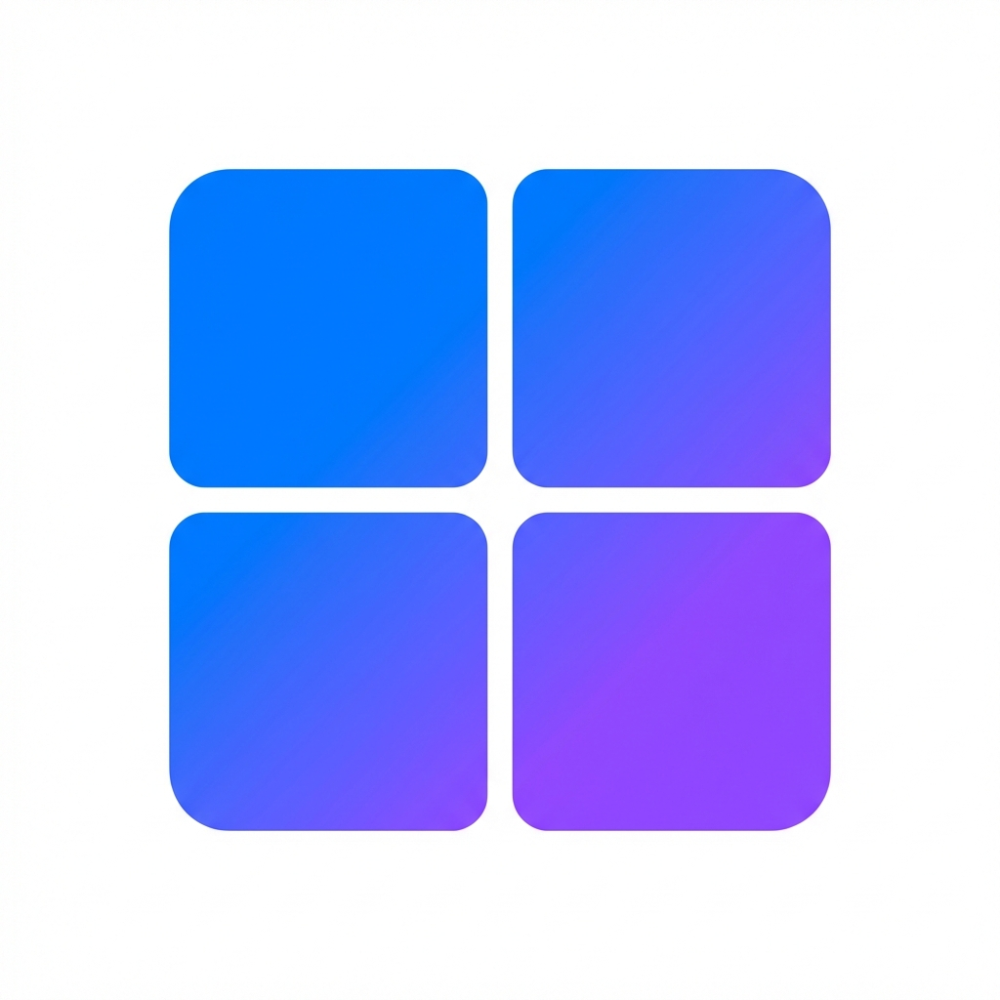

<p align="center">
  
</p>

<h1 align="center">Bitscale Data Grid</h1>

<p align="center">
  <strong>Enterprise-grade data enrichment platform with blazing-fast virtualized grids</strong>
</p>

<p align="center">
  <a href="#features">Features</a> •
  <a href="#demo">Demo</a> •
  <a href="#quick-start">Quick Start</a> •
  <a href="#architecture">Architecture</a> •
  <a href="#tech-stack">Tech Stack</a>
</p>

<p align="center">
  
  
  
  
</p>

---

## ✨ Features

### Core Grid Capabilities

| Feature                        | Description                                                          |
| ------------------------------ | -------------------------------------------------------------------- |
| **Virtual Scrolling**    | Render 10,000+ rows at 60fps with TanStack Virtual                   |
| **Multi-Tab Workspaces** | Switch between datasets with independent state per tab               |
| **Column Resizing**      | Drag-to-resize columns with persistent widths                        |
| **Bulk Selection**       | Select individual rows, ranges, or all with keyboard shortcuts       |
| **Real-time Enrichment** | Simulate email/phone/LinkedIn data enrichment with progress tracking |

### UI/UX

| Feature                        | Description                                                                |
| ------------------------------ | -------------------------------------------------------------------------- |
| **Sticky Header**        | Column headers remain visible while scrolling                              |
| **Status Badges**        | Visual indicators for email status (Found/Not Met)                         |
| **Company Logos**        | Dynamic logo rendering for Google, Amazon, Microsoft, Apple, LinkedIn, TED |
| **Toast Notifications**  | Non-blocking feedback for all user actions                                 |
| **Responsive Dropdowns** | Contextual menus for Sort, Filter, Actions, Enrichment                     |

### Data Management

| Feature                    | Description                                  |
| -------------------------- | -------------------------------------------- |
| **Load Data Modal**  | Import from CSV, API, or Database sources    |
| **Column Picker**    | Toggle visibility of 12+ data columns        |
| **Filter Panel**     | Build complex filter rules with AND/OR logic |
| **Export to CSV**    | Download selected or all rows                |
| **Duplicate/Delete** | Bulk operations on selected rows             |

---

## 🎬 Demo

### Grid Navigation

- **Scroll** through 1,000+ virtualized rows
- **Click tabs** at bottom to switch datasets (each tab has unique data)
- **Resize columns** by dragging header borders

### Enrichment Workflow

1. Click **Enrichment** → Select enrichment type
2. Watch **progress indicator** update in real-time
3. Use **Kill Run** to cancel ongoing jobs

### Actions

- Select rows → **Action** menu → Export/Duplicate/Delete
- Toggle **Auto Run** and **Auto Dedupe** for automation

---

## 🚀 Quick Start

```bash
# Clone the repository
git clone https://github.com/yourusername/bitscale-data-grid.git
cd bitscale-data-grid

# Install dependencies
npm install

# Start development server
npm run dev

# Open in browser
open http://localhost:3000
```

### Build for Production

```bash
npm run build
npm start
```

---

## 🏗️ Architecture

```
src/
├── app/                      # Next.js 14 App Router
│   ├── layout.tsx            # Root layout with providers
│   ├── page.tsx              # Main application page
│   └── globals.css           # Global styles & design tokens
│
├── components/
│   ├── ui/                   # Primitives: Button, Badge, Chip, Toast
│   ├── layout/               # Header, Toolbar, BottomTabs, PaymentBanner
│   ├── grid/                 # DataGrid, GridHeader, GridRow, GridCell
│   ├── modals/               # LoadDataModal, ColumnPickerModal
│   ├── panels/               # FilterPanel
│   └── notifications/        # ToastContainer
│
├── store/
│   ├── index.ts              # Redux store configuration
│   └── slices/
│       ├── authSlice.ts      # User authentication state
│       ├── workspacesSlice.ts # Tabs & workbook management
│       ├── gridMetaSlice.ts  # Column definitions & widths
│       ├── tabDataSlice.ts   # Per-tab row data (normalized)
│       ├── rowsSlice.ts      # Legacy row data
│       ├── jobsSlice.ts      # Enrichment job tracking
│       ├── uiSlice.ts        # Modals, toasts, filters
│       └── settingsSlice.ts  # User preferences
│
├── hooks/
│   ├── useRedux.ts           # Typed Redux hooks
│   └── useJobSimulation.ts   # Enrichment job simulation
│
├── styles/
│   ├── tokens.css            # Design tokens (colors, spacing)
│   ├── components.css        # Shared component styles
│   └── utilities.css         # Utility classes
│
└── types/
    └── index.ts              # TypeScript interfaces
```

---

## 🛠️ Tech Stack

| Category                 | Technology        | Purpose                         |
| ------------------------ | ----------------- | ------------------------------- |
| **Framework**      | Next.js 16        | React framework with App Router |
| **Language**       | TypeScript 5      | Type-safe development           |
| **State**          | Redux Toolkit     | Predictable state management    |
| **Tables**         | TanStack Table v8 | Headless table logic            |
| **Virtualization** | TanStack Virtual  | Efficient large list rendering  |
| **UI Primitives**  | Radix UI          | Accessible component primitives |
| **Icons**          | Lucide React      | Modern icon library             |
| **Styling**        | CSS Modules       | Scoped component styles         |

---

## ⚡ Performance

### Virtualization Strategy

- Only **~20 rows** rendered at any time (regardless of dataset size)
- Row height estimation: **48px** with **10-row overscan**
- Scroll position restoration on tab switch

### State Normalization

```typescript
// Normalized state for O(1) lookups
{
  byId: { "row-1": {...}, "row-2": {...} },
  allIds: ["row-1", "row-2", ...],
  selectedIds: ["row-1"]
}
```

### Optimizations

- `React.memo` on GridRow components
- `useMemo` for derived data
- CSS `position: sticky` for header (no JS)
- Horizontal scroll sync via `scrollLeft` (not state)

---

## 📁 Key Files

| File                                          | Description                              |
| --------------------------------------------- | ---------------------------------------- |
| `src/app/page.tsx`                          | Main application with modals integration |
| `src/components/grid/DataGrid/DataGrid.tsx` | Virtualized grid with TanStack           |
| `src/store/slices/tabDataSlice.ts`          | Per-tab data management                  |
| `src/hooks/useJobSimulation.ts`             | Enrichment job with progress             |
| `src/styles/tokens.css`                     | Design system tokens                     |

---

## 🎨 Customization

### Design Tokens

Edit `src/styles/tokens.css` to customize:

- Color palette
- Spacing scale
- Typography
- Border radius
- Shadows

### Adding Columns

1. Update `gridMetaSlice.ts` with column definition
2. Add accessor in `GridCell.tsx`
3. Update `Row` type in `types/index.ts`

---


<p align="center">
  Built with Next.js, Redux, and TanStack
</p>
